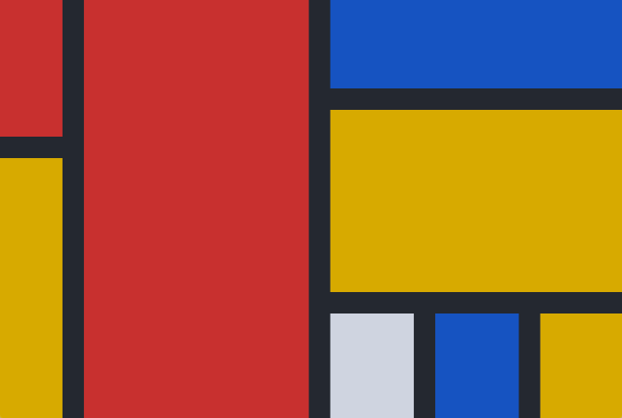

# Flutter Layout Grid




A grid-based layout system for Flutter, optimized for user interface design.
Featuring:

- Fixed, flexible, and content-based row and column sizing
- Precise control over placement of items if desired, including the ability to
  span rows and columns, and overlap items
- A configurable automatic grid item placement algorithm, capable of sparse and
  dense packing across rows and columns
- Right-to-left support, driven by ambient `Directionality` or configuation
- Gutters!

## Getting Started

All the terminology used in this library is shared with the CSS Grid Layout
spec. If you're unfamiliar, I recommend taking a look at [MDN's glossary of grid
terms](https://developer.mozilla.org/en-US/docs/Web/CSS/CSS_Grid_Layout#Glossary_entries).

For inclusion in your pubspec, see
[pub.dev](https://pub.dev/packages/flutter_layout_grid#-installing-tab-).

## Example

This is the source for the sample you can see above.

```dart
const cellRed = Color(0xffc73232);
const cellMustard = Color(0xffd7aa22);
const cellGrey = Color(0xffcfd4e0);
const cellBlue = Color(0xff1553be);
const background = Color(0xff242830);

class Piet extends StatelessWidget {
  @override
  Widget build(BuildContext context) {
    return Container(
      width: 240,
      height: 200,
      color: background,
      child: LayoutGrid(
        columnGap: 12,
        rowGap: 12,
        templateColumnSizes: [
          FlexibleTrackSize(1),
          FlexibleTrackSize(3.5),
          FlexibleTrackSize(1.3),
          FlexibleTrackSize(1.3),
          FlexibleTrackSize(1.3),
        ],
        templateRowSizes: [
          FlexibleTrackSize(1),
          FlexibleTrackSize(0.3),
          FlexibleTrackSize(1.5),
          FlexibleTrackSize(1.2),
        ],
        children: [
          // Column 1
          GridPlacement(
            columnStart: 0,
            rowStart: 0, rowSpan: 2,
            child: _buildItemForColor(cellRed),
          ),
          GridPlacement(
            columnStart: 0,
            rowStart: 2, rowSpan: 2,
            child: _buildItemForColor(cellMustard),
          ),
          // Column 2
          GridPlacement(
            columnStart: 1,
            rowStart: 0, rowSpan: 4,
            child: _buildItemForColor(cellRed),
          ),
          // Column 3
          GridPlacement(
            columnStart: 2, columnSpan: 3,
            rowStart: 0,
            child: _buildItemForColor(cellBlue),
          ),
          GridPlacement(
            columnStart: 2, columnSpan: 3,
            rowStart: 1, rowSpan: 2,
            child: _buildItemForColor(cellMustard),
          ),
          GridPlacement(
            columnStart: 2,
            rowStart: 3,
            child: _buildItemForColor(cellGrey),
          ),
          // Column 4
          GridPlacement(
            columnStart: 3,
            rowStart: 3,
            child: _buildItemForColor(cellBlue),
          ),
          // Column 5
          GridPlacement(
            columnStart: 4,
            rowStart: 3,
            child: _buildItemForColor(cellMustard),
          ),
        ],
      ),
    );
  }

  Widget _buildItemForColor(Color c) =>
      DecoratedBox(decoration: BoxDecoration(color: c));
}
```

## Usage

### Sizing of Columns and Rows

There are currently three way to size tracks (rows or columns):

- `FlexibleSizeTrack` — consumes remaining space after the initial layout has
  completed.
- `FixedSizeTrack` — occupies a specific number of pixels on an axis
- `IntrinsicContentTrackSize` — sized to contain its items' contents. Will also
  expand to fill available space, once `FlexibleTrackSize` tracks have been
  given the opportunity.

Technically, you could define your own, but I wouldn't because the API will be
evolving.

### Placing widgets in the `LayoutGrid`

When an arbitrary widget is provided to `LayoutGrid.children`, it will be
allotted a single cell and placed automatically according to the
`LayoutGrid.autoPlacement` algorithm ([described
here](https://developer.mozilla.org/en-US/docs/Web/CSS/CSS_Grid_Layout/Auto-placement_in_CSS_Grid_Layout)).

Precise control over placement of an item is provided via the `GridPlacement`
widget. You can think of `GridPlacement` as the
[`Positioned`](https://api.flutter.dev/flutter/widgets/Positioned-class.html)
equivalent for `LayoutGrid` — it controls the where a widget is placed, and the
cells it occupies.

```dart
LayoutGrid(
  children: [
    GridPlacement(
      // All parameters optional
      columnStart: 1,
      columnSpan: 3,
      rowStart: 5,
      rowSpan: 2,
      child: MyWidget(),
    ),
  ],
)
```

All of the `GridPlacement`'s constructor parameters are optional. It defaults to
a 1x1 grid item that will be placed automatically by the grid. Specifying
positioning or spanning information (via
`columnStart`/`columnSpan`/`rowStart`/`rowSpan` parameters) will feed additional
constraints into its algorithm.

A definitely-placed item (meaning `columnStart` and `rowStart` have both been
provided), will always be placed precisely, even if it overlaps other
definitely-placed items. Automatically-placed items will flow around those that
have been placed definitely.

#### Accessibility and Placement

Take note that the meaning you convey visually through placement may not be
clear to all users, as the
[`Semantics`](https://api.flutter.dev/flutter/widgets/Semantics-class.html)
widget expose items to the accessibility system in the same order as the
`LayoutGrid.children` list.

In situations where your visual ordering differs from ordering in the source,
the accessible ordering can be configured via the `Semantics` widget's
[`sortKey`](https://api.flutter.dev/flutter/semantics/SemanticsSortKey-class.html)
parameter.

## Differences from CSS Grid Layout

Things in CSS Grid Layout that are not supported:

- Negative row/column starts/ends. In CSS, these values refer to positions
  relative to the end of a grid's axis.
- Any cells outside of the explicit grid. If an item is placed outside of the
  area defined by your template rows/columns, we will throw an error. Support
  for automatic addition of rows and columns to accommodate out of bound items
  is being considered.
- minmax(), percentages, aspect ratios track sizing
- Named template areas, although they're coming

Differences:

- In `flutter_layout_grid`, flexible tracks do not account for their content's
  base sizes as they do in CSS. It's expensive to measure, and I felt this was
  an acceptable tradeoff.
- Flexible tracks whose flex factors sum to < 1

## Why not Slivers?

This library is not
[Sliver](https://medium.com/flutter/slivers-demystified-6ff68ab0296f)-based. I'd
considered it, but my use cases required the content-based sizing of rows and
columns, and I didn't want to figure out the UI challenges associated with
resizing. I might be interested in taking those on at some point.

## Roadmap

- [ ] Tests!
- [ ] Named template areas, for friendlier item placement
- [ ] Improved track sizing, including minimum/maximums and aspect ratios
- [ ] The ability to specify row and column gaps at specific line locations via
      a delegate
- [ ] Implicit grid support (automatic growth along an axis as children are
      added)
- [ ] Performance improvements, as soon as I can get this profiler running(!!!)
